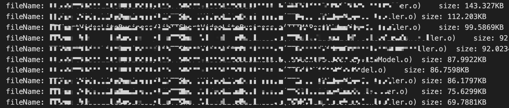
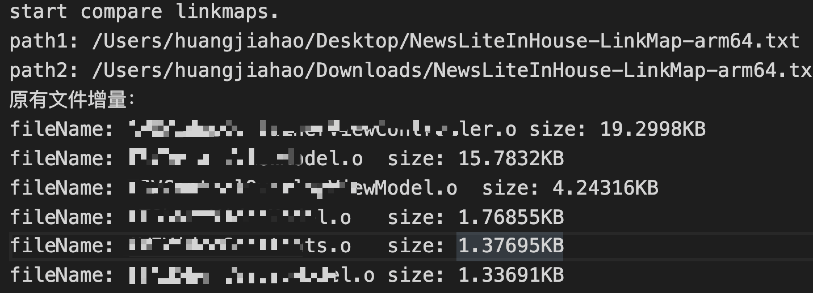
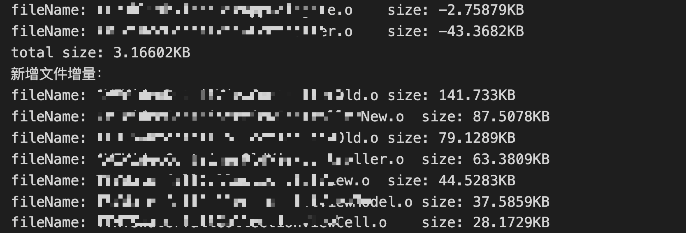
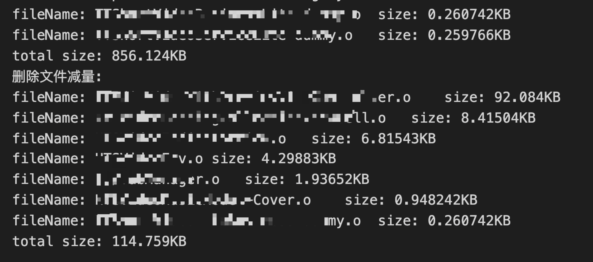

// 刚学的c++，代码写得比较烂

# feature （2020.02.04）

## 1 根据linkmap文件分析包大小明细 && 比较两个linkmap的增量情况

使用方法：

直接clone下仓库，找到main.cpp文件，根据注释修改linkmap 文件路径、输出文件路径等参数。运行后查看输出文件即可。

输出结果大概长得像下面那样：

单个linkmap明细:

对比linkmap增量:

